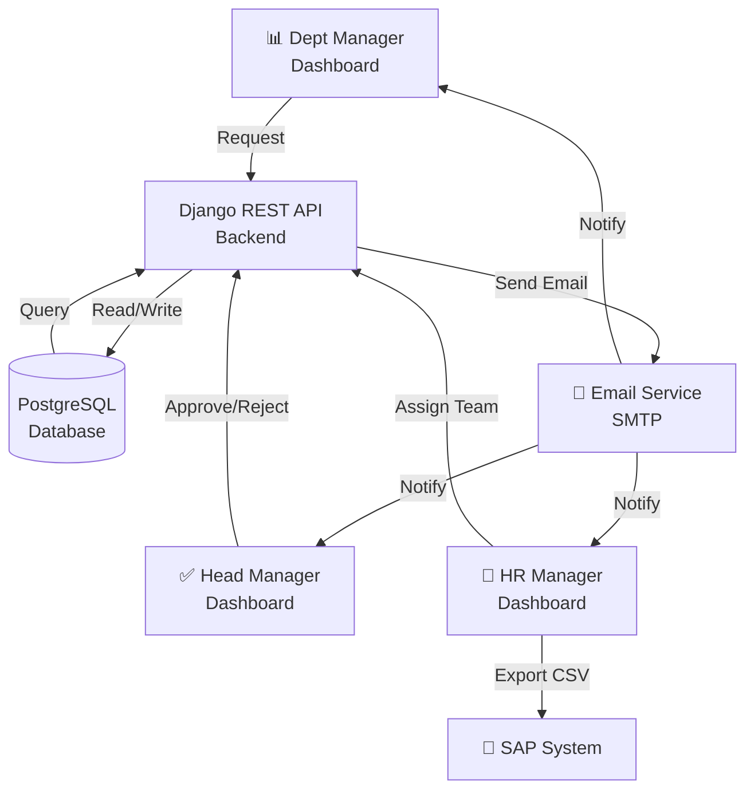
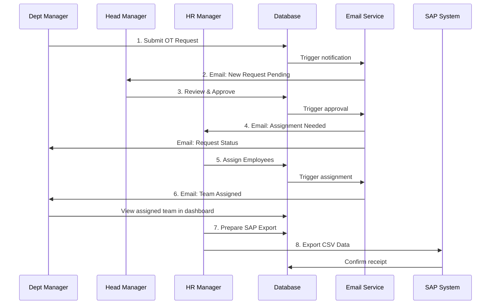

# System Architecture & Workflow

## Component Diagram

## Overtime Request Workflow

## Data Flow

1. **Request Submission** → OvertimeRequest created
2. **Notification to Head Manager** → Email sent, status = 'pending'
3. **Approval** → OvertimeRequest.status = 'approved', approved_by set
4. **Assignment Phase** → EmployeeAssignment created
5. **HR Assignment** → Employees assigned via ManyToMany
6. **Notification to Dept Manager** → Email with team details
7. **SAP Export** → CSV generated and sent, SAPExport record created
8. **Dashboard Update** → All roles see updated request status

## User Permissions

| Action | Dept Manager | Head Manager | HR Manager | Admin |
|--------|:------------:|:------------:|:----------:|:-----:|
| Submit Request | ✅ | ❌ | ❌ | ✅ |
| View Requests | Own Only | All | All | All |
| Approve/Reject | ❌ | ✅ | ❌ | ✅ |
| Assign Employees | ❌ | ❌ | ✅ | ✅ |
| Export CSV | ❌ | ❌ | ✅ | ✅ |
| View Audit Log | ❌ | ✅ | ✅ | ✅ |

## API Response Status Codes

- `201` - Request created successfully
- `200` - Request approved/rejected
- `400` - Validation error
- `401` - Unauthorized
- `403` - Permission denied
- `404` - Request not found
- `500` - Server error
